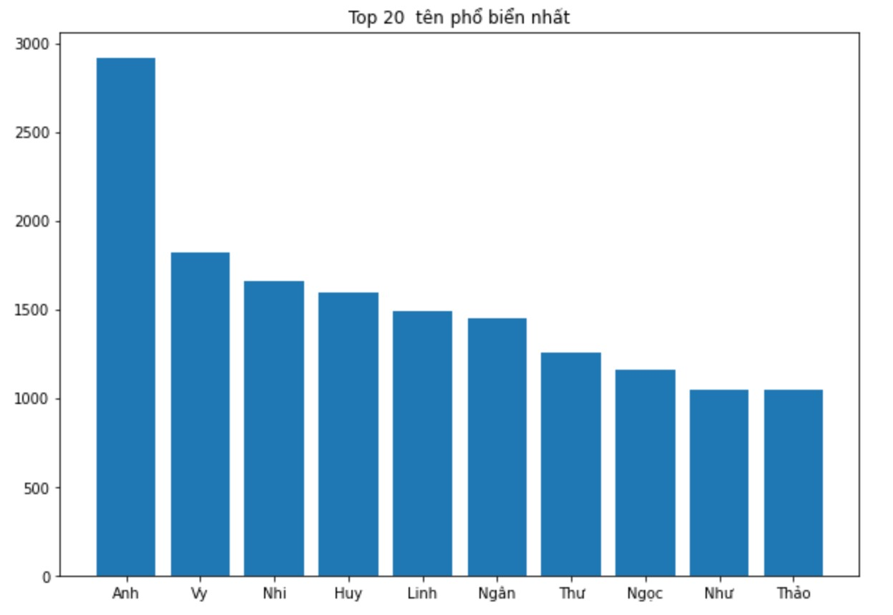
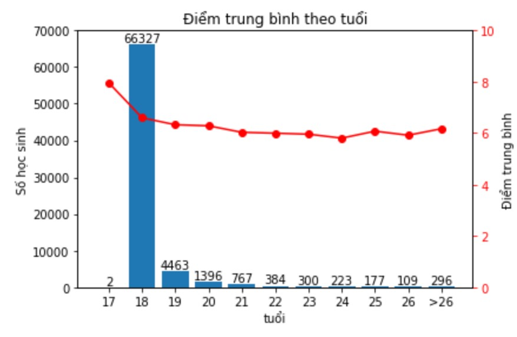
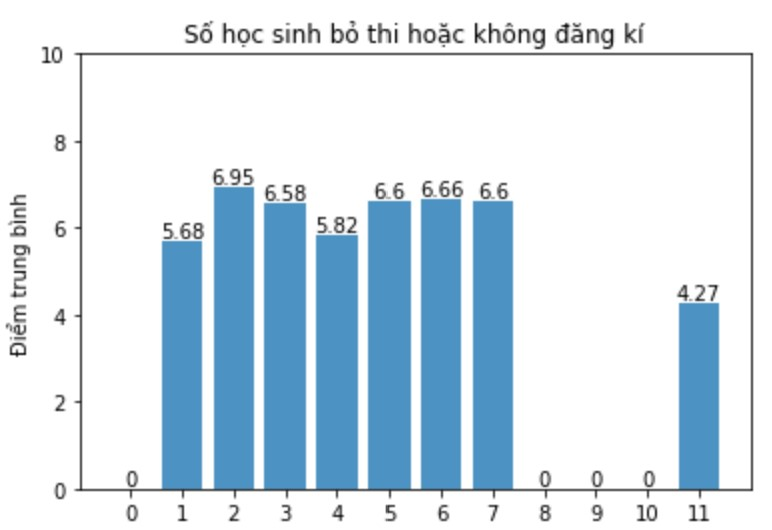

# :point_right: [Project 1: Using SQL for marketing analytics? Why not](https://github.com/Trisdoan/SQL_Serious_SQL/tree/main/Marketing_Analytics)

**Dataset**: DVD Rental Co customer records.

* In order to run a email marketing campaign, a markting team at DVD Rental Co asked to help them to get necessary data points. 
* In this project, I implemented these techniques to create a final report **Join, Aggregation functions, CTEs** and **Windown Functions**.

# :point_right: [Project 2: Another SQL project](https://github.com/Trisdoan/SQL_Serious_SQL/tree/main/Danny_Dinner_Analytics)

**Dataset**: Restaurant customer records.
* Helped the owner of the restauntant to generate a final report so his team can easily inspect the data without needing to use SQL.
* In this project, I implemented these techniques to solve this problem

# :point_right: [Project 3: Using Python to analyze graduation examination](https://github.com/Trisdoan/Graduation_Examination_Analytics)

**Dataset**: Vietnamese students taking high school graduation exam in 2020.

These are what I did:
1. Used FileIO to read data.txt
2. Used techniques to extract clean data
3. Visualized the following insights:
    * Top first names of candidates
    * Top last names of candidates
    * Avarage scores of 11 groups of ages
    * Average scores of candidates who did not sit for some subjects
    * Numbers of candidates who did not sit for some subjects

  

# Project 4: Ecommerce Marketing Analytics

# Project 5: Work-life balance analytics

# Project 6: Video Player

### Project 7: Ecommerce Marketing Analytics

### Project 8: Airbnb Analytics

