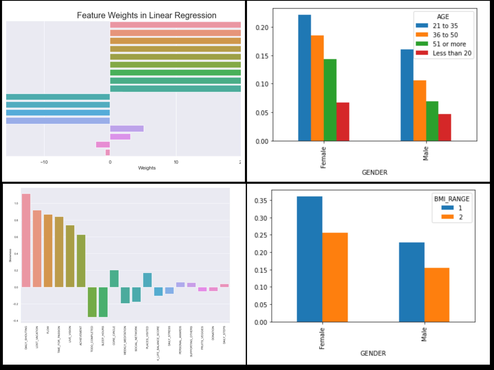

# Personal Projects

## Project 1: Markerting Analytics by SQL

 

**Dataset**: DVD Rental Co customer records.

* In order to run a email marketing campaign, a markting team at DVD Rental Co asked to help them to get necessary data points. 
* I used **Postgresql** to create a final report.

## Project 2: Customer Behavior Analytics by SQL
 

**Dataset**: Restaurant customer records.
* Helped the owner of the restauntant to generate a final report so his team can easily inspect the data without needing to use SQL.
* I use **PostgreSQL** to tackle some headache questions from the owner

## Project 3: Using Python to see which factors affecting our life
 

**Dataset**: Lifestyle and wellbeing dataset.

* I want to know which factors affecting our work life and find ways to improve quality of work life
* Then build a mode to predict our life quality.

## Project 4: Ecommerce Marketing Analytics by SQL
 

**Dataset**: Restaurant customer records.

Provide answers for ad-hoc request from manager.

* Using trended perfomance data to show company's growth

* Explain details company's perfomance

* Quantify the revenue impact

* Analyze current performance and assess upcoming opportunities

* Explain growth by diving to channels and website optimizations

## Project 5: HR Analytics
 

**Dataset**: Employee database

I used **PostgreSQL**
* 
